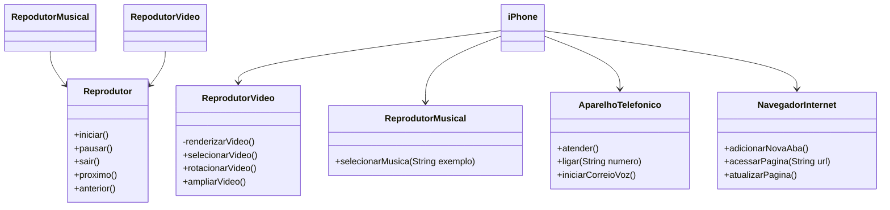

# Desafio de orientação a objetos em Java

### Diagrama UML

```mermaid
classDiagram
    class Reprodutor {
        +iniciar()
        +pausar()
        +sair()
        +proximo()
        +anterior()
    }

    class ReprodutorMusical {
        +selecionarMusica(String exemplo)
    }
    
    RepodutorMusical --> Reprodutor
    
    class ReprodutorVideo {
        -renderizarVideo()
        +selecionarVideo()
        +rotacionarVideo()
        +ampliarVideo()   
    }
    
    RepodutorVideo --> Reprodutor

    class AparelhoTelefonico {
        +atender()
        +ligar(String numero)
        +iniciarCorreioVoz()
    }

    class NavegadorInternet {
        +adicionarNovaAba()
        +acessarPagina(String url)
        +atualizarPagina()
    }

    class iPhone {
    }
    
    iPhone --> ReprodutorVideo
    iPhone --> ReprodutorMusical
    iPhone --> AparelhoTelefonico
    iPhone --> NavegadorInternet
```